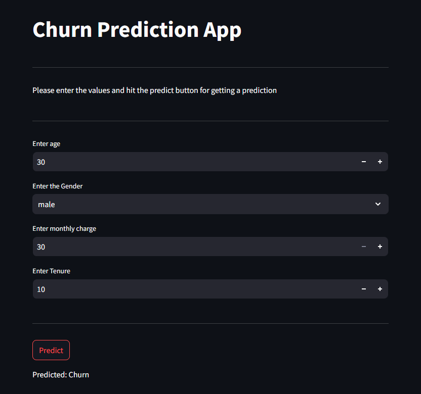

📌 Customer Churn Prediction using Streamlit
🚀 Overview
This is a Customer Churn Prediction Web App built using Streamlit. The app allows users to input customer details and predicts whether a customer is likely to churn based on a pre-trained machine learning model.

📂 Project Structure
📦 Customer-Churn-Prediction
│-- app.py                # Streamlit Web App
│-- model.pkl             # Trained ML Model
│-- scaler.pkl            # Scaler for Input Data
│-- requirements.txt      # Dependencies
│-- README.md             # Project Documentation

📌 Features
✅ Simple and Interactive UI using Streamlit
✅ Takes Age, Gender, Tenure, and Monthly Recharge as inputs
✅ Predicts whether a customer will Churn (Yes/No)
✅ Uses Joblib for loading the pre-trained model

⚙️ How to Run the App
1️⃣ Install Dependencies
First, install the required Python packages using:
pip install -r requirements.txt

2️⃣ Run the Streamlit App
streamlit run app.py

🛠 Model Details
Model Used: Pre-trained ML Model (model.pkl)
Scaler Used: StandardScaler (scaler.pkl)

Input Features:
Age (Numeric)
Gender (Male → 0, Female → 1)
Tenure (Duration of subscription)
Monthly Recharge (Monthly charge for services)

Prediction Output:
1 → Churn (Customer will leave)
0 → Not Churn (Customer will stay)

🖥️ Web App Demo
🔹 Enter values → Click Predict → Get the prediction result

📜 Dependencies
The app requires the following Python libraries:
1.streamlit
2.joblib
3.numpy
4.Pandas

Install them using:
pip install streamlit joblib numpy
